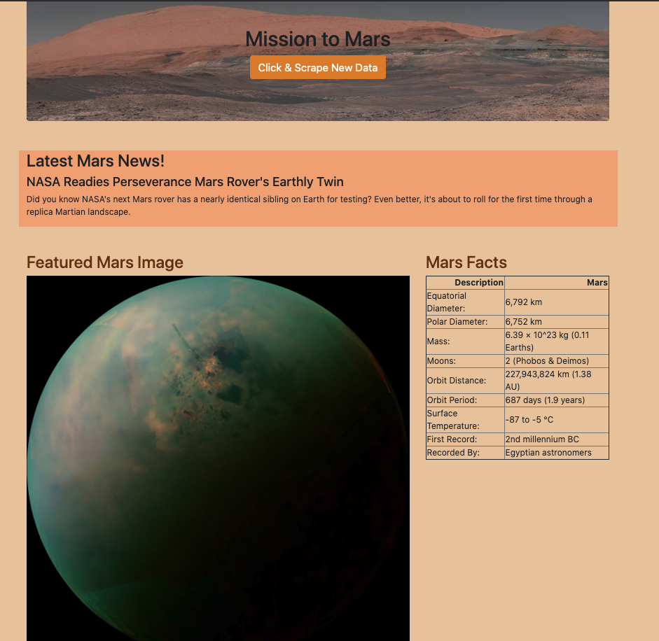

# Web-Scraping-Challenge
In this assignment, I built a web application that scraped various websites for data related to the Mission to Mars and displays the information in a single HTML page. 

* The main webpage image

## Step 1 - Scraping
Completed my initial scraping using Jupyter Notebook, BeautifulSoup, Pandas, and Requests/Splinter.

* Created a Jupyter Notebook file called `mission_to_mars.ipynb` and used this to complete all of your scraping and analysis tasks. 

### NASA Mars News

* Scraped the [NASA Mars News Site](https://mars.nasa.gov/news/) and collected the latest News Title and Paragraph Text. Assigned the text to variables that I referenced later.

### JPL Mars Space Images - Featured Image

* Visited the url for JPL Featured Space Image [here](https://www.jpl.nasa.gov/spaceimages/?search=&category=Mars).

* Used splinter to navigate the site and find the image url for the current Featured Mars Image and assigned the url string to a variable called `featured_image_url`.

### Mars Facts

* Visited the Mars Facts webpage [here](https://space-facts.com/mars/) and used Pandas to scrape the table containing facts about the planet including Diameter, Mass, etc.

* Used Pandas to convert the data to a HTML table string.

### Mars Hemispheres

* Visited the USGS Astrogeology site [here](https://astrogeology.usgs.gov/search/results?q=hemisphere+enhanced&k1=target&v1=Mars) to obtain high resolution images for each of Mar's hemispheres.

* I used click links to the hemispheres in order to find the image url to the full resolution image.

* I saved both the image url string for the full resolution hemisphere image, and the Hemisphere title containing the hemisphere name. I used a Python dictionary to store the data using the keys `img_url` and `title`.

* I appended the dictionary with the image url string and the hemisphere title to a list. This list contained one dictionary for each hemisphere.

## Step 2 - MongoDB and Flask Application

I used MongoDB with Flask templating to create a new HTML page that displays all of the information that was scraped from the URLs above.

* I started by converting your Jupyter notebook into a Python script called `scrape_mars.py` with a function called `scrape_all()` that executed all of my scraping code from above and returned one Python dictionary containing all of the scraped data. I modified some scripts in python when I had errors in python.

* I created a route called `/scrape` that imported my `scrape_mars.py` script and called my `scrape` function.

* I stored the return value in Mongo as a Python dictionary.

* I created a root route `/` that quered my Mongo database and passed the mars data into an HTML template to display the data.

* I created a template HTML file called `index.html` that took the mars data dictionary and displayed all of the data in the appropriate HTML elements. 
